> ## Learning objectives {.objectives}
>
> * To be able to use ggplot2 to generate publication quality graphics
> * To understand the basics of the grammar of graphics:
>   - The aesthetics layer
>   - The geometry layer(s)
>   - Adding statistics
>   - Transforming scales
>   - Modifying geom aesthetics by color/shape/size/linetype
>   - Faceting
>

Plotting is essential to understanding your data and the relationships in it. You should be making plots throughout the analysis and modeling process. There are three main plotting systems in R,
the [base plotting system][base], the [lattice][lattice]
package, and the [ggplot2][ggplot2] package.

[base]: http://www.statmethods.net/graphs/
[lattice]: http://www.statmethods.net/advgraphs/trellis.html
[ggplot2]: http://www.statmethods.net/advgraphs/ggplot2.html

We will learn `ggplot`, because
it is effective and efficient, makes publication-quality
graphics, and is theoretically grounded in the grammar of graphics
-- the idea that any plot can be expressed from the same
set of components: a **data** set, a **coordinate system**, 
and a set of **geoms**--the visual representation of data points.

### Installing and loading packages

`ggplot` is not part of "base R"; rather it is a package -- a library of functions that an R user wrote. This extensibility is part of the beauty of R. As of December 2016, there are 9,600 such packages in the official Comprehensive R Archive Network, better known as [CRAN](https://cran.r-project.org/). 

`ggplot` is one of the most popular packages for R. It is part of a suite of R tools that make up "The Tidyverse". Its author conveniently bundled these tools together in a super-package called `tidyverse`. To use the tidyverse tools, you first need to download them to your machine (once) and then load them (each R session you want to use them). You can download a package via the RStudio menu bar Tools -> Install Packages..., or with a line of code:

~~~{.r}
install.packages('tidyverse')
~~~

You only have to download the code once. But whenever you want to *use* a package, you have to load it in your R session. For that, use the `library` function:

~~~{.r}
library(tidyverse)
~~~

~~~{.output}
Loading tidyverse: ggplot2
Loading tidyverse: tibble
Loading tidyverse: tidyr
Loading tidyverse: readr
Loading tidyverse: purrr
Loading tidyverse: dplyr

~~~

~~~{.output}
Conflicts with tidy packages ----------------------------------------------

~~~

~~~{.output}
filter(): dplyr, stats
lag():    dplyr, stats

~~~

> #### Challenge -- Install and load tidyverse {.challenge}
>
> - Install the `tidyverse` package, either with `install.packages('tidyverse')` or via the menu bar: Tools -> Install Packages...  
> - Load `tidyverse` with `library(tidyverse)`  
>   - You will see some warnings about conflicts. That's okay.

### First plots

The key to understanding ggplot is thinking about a figure in layers: 
just like you might do in an image editing program like Photoshop, Illustrator, or Inkscape.

Let's start off with an example, longevity as a function of gdp:

~~~{.r}
ggplot(gapminder, aes(x = gdpPercap, y = lifeExp)) +
  geom_point()
~~~

The first thing we do is call the `ggplot` function. This function tells ggplot what dataset we're using (gapminder) and how to map variables in gapminder to the plotting "canvas" (gdp to the x-axis, life expectancy to the y-axis). That **mapping** of variables to plot elements is done through the `aes` function. Arguments to `aes` will be variable names from the `data.frame` passed to `ggplot`. If you need a reminder of what's in our data.frame, use `str(gapminder)`.

By itself, the call to `ggplot` isn't enough to draw a figure. This sets up the canvas correctly, but it doesn't draw anything on it.

~~~{.r}
ggplot(gapminder, aes(x = gdpPercap, y = lifeExp))
~~~

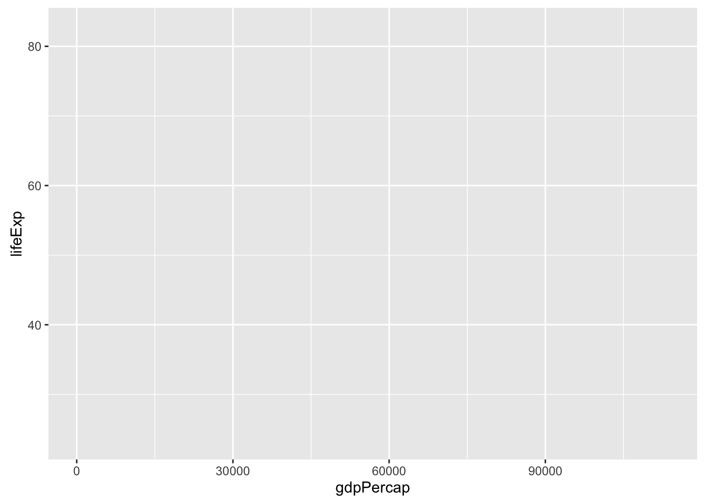

Now we need to tell `ggplot` how to draw the data. For that, we add another layer: a **geom**. 
In our example, we used `geom_point`, which tells `ggplot` we want to draw a point for each row in the dataset. 

Note that we tell R that multiple lines belong to `ggplot` by including a `+` at the end of each line except the last.

~~~{.r}
ggplot(gapminder, aes(x = gdpPercap, y = lifeExp)) +
  geom_point()
~~~

> #### Challenge -- Changing a variable {.challenge}
>
> Modify the following code to make a figure that shows how life expectancy has
> changed over time:
>
> 
> ~~~{.r}
> ggplot(gapminder, aes(x = gdpPercap, y = lifeExp)) + 
> geom_point()
> ~~~
>
> Hint: Inspect the data with `head(gapminder)` or `str(gapminder)` to find
> the name of the variable representing time. It should go on the x-axis.
>
>
> **Bonus**: So far, we have only mapped variables to the **x** and **y** locations of each point.
> Another *aesthetic* property we can modify is the point `color`. Modify the
> code from the previous challenge to **color** the points by the "continent"
> column. What trends do you see in the data? Are they what you expected?
>

### Layers

Using a scatterplot probably isn't the best for visualizing change over time.
Let's add another layer to the plot -- lines connecting the points representing
each country:

~~~{.r}
ggplot(gapminder, aes(x = year, y = lifeExp, color = continent)) +
    geom_point() +
    geom_line()
~~~

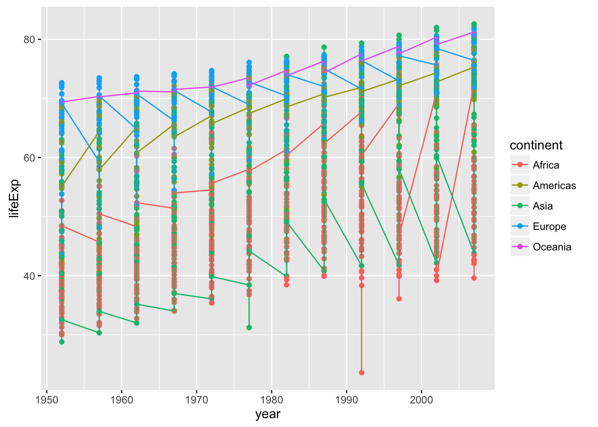

Hmm, that's not quite right. What has happened there? How many lines are there?

The lines are grouped by continent. We wanted one line per country, but we got one line per continent because we mapped continent to color and `ggplot` assumes we want to group by the coloring variable unless we tell it otherwise. To get one line per country we tell ggplot explicitly to group by country. Just like the other aesthetic mappings, that goes in the `aes()` function:

~~~{.r}
ggplot(gapminder, 
       aes(x = year, y = lifeExp, color = continent, group = country)) +
    geom_point() +
    geom_line()
~~~

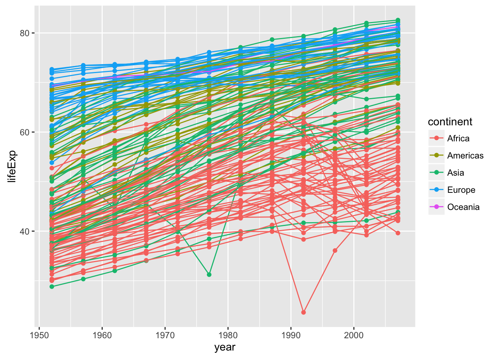

Note that aesthetic mappings in the top-line `ggplot` call apply to all layers,
but you can also map variables just within a single layer. For example, if we
want colored lines but black points, we can move the mapping of continent-to-color from the `ggplot` line to the `geom_line`, so that it no longer applies to `geom_point`.

~~~{.r}
ggplot(gapminder, aes(x = year, y = lifeExp, group = country)) +
    geom_point() +
    geom_line(aes(color = continent))
~~~

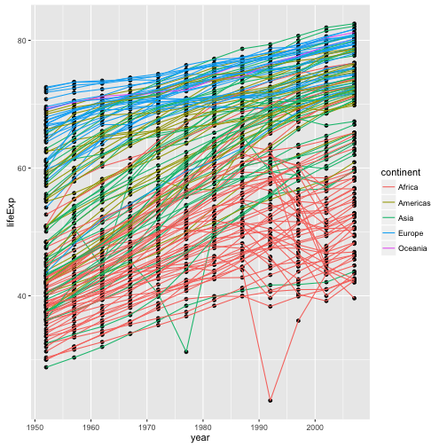

Note that each layer is drawn on top of the previous layer. If we want the points on top of the lines, we can move `geom_point` to after `geom_line`:

~~~{.r}
ggplot(gapminder, aes(x = year, y=lifeExp, by=country)) +
    geom_line(aes(color = continent)) + 
    geom_point()
~~~

### Continuous vs. discrete variables

The plots we have done so far have plotted numeric variables to both axes. What if we want to plot a numeric variable against a categorical variable, such as continent. 

**Shoutout Q: What kind of plot can we use to plot a continuous variable versus a categorical variable, say life expectency by continent?**

> NB: A barchart (or, less likely, a dotchart) is suboptimal because it requires summarizing the data to the mean or median or whatever -- we'd rather preserve the information present in the full distribution.

One possibility is a boxplot. In a boxplot, the distribution of values for each category is displayed, with the central line at the median value, the box representing the inner-50%, etc.

~~~{.r}
ggplot(gapminder, aes(x = continent, y = lifeExp)) +
    geom_boxplot()
~~~

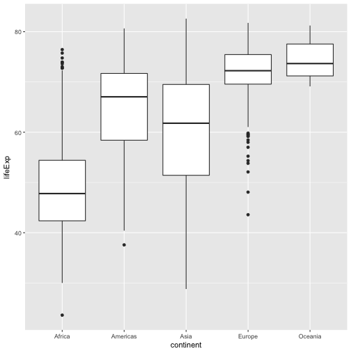

> #### Challenge -- A new geom {.challenge}
>
> Violin plots are an alternative to boxplots that present the entire distribution of the continuous variable. 
> 
> - Can you change the last plot from a boxplot to a violin plot?
> - Can you color each violin by its continent? 
>       - Tip: Try out the `fill` aesthetic.
>
> **Bonus**: Suppose you want to examine the distribution of life expectencies across all countries together; that is, you want a single plot of showing the distribution of all life-expectancy values. There are a few geom's that can do this: Can you make one?

### Transformations

The grammar of graphics makes it easy to transform the scales on which the data are presented. To demonstrate we'll go back to our first example:

~~~{.r}
ggplot(gapminder, aes(x = gdpPercap, y = lifeExp)) +
    geom_point() 
~~~

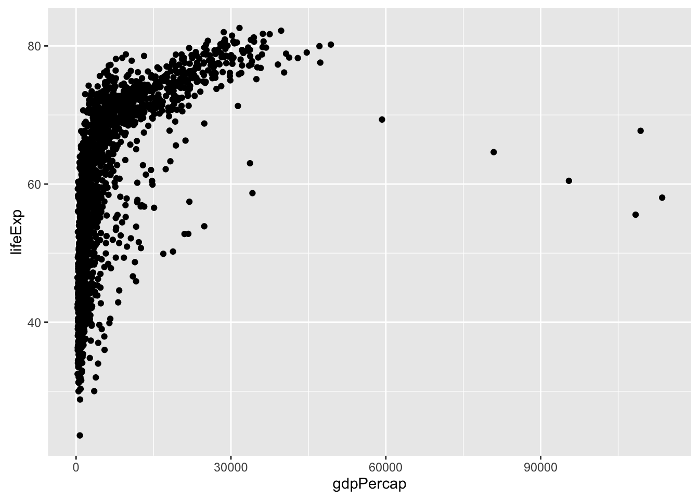

Currently it's hard to see the relationship between the points due to some strong
outliers in GDP per capita. We can change the scale of units on the x-axis using
the *scale* functions. These control the mapping between the data values and
visual values of an aesthetic.

The `log10` function applies a transformation to the values of the `gdpPercap`
column before rendering them on the plot, so that each multiple of 10 now only
corresponds to an increase in 1 on the transformed scale, e.g. a GDP per capita
of 1,000 is now 3 on the x-axis, a value of 10,000 corresponds to 4 on the x-axis and so on. This makes it easier to visualize the spread of data on the
x-axis.

~~~{.r}
ggplot(gapminder, aes(x = gdpPercap, y = lifeExp)) +
    geom_point() + 
    scale_x_log10()
~~~

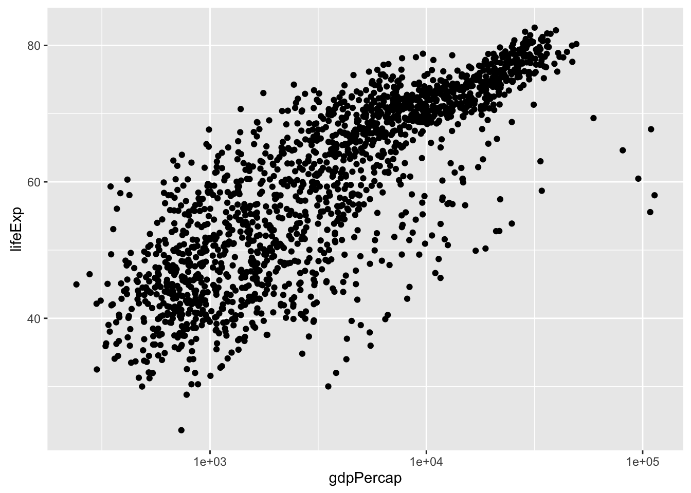

### Adding models

We can fit a simple, linear relationship to the data by adding another layer,
`geom_smooth`, which adds a summary of a fit model to the plot. `method = 'lm'` tells `geom_smooth` to fit a **l**inear **m**odel. We could also fit other, more flexible smoothers by specifying different methods in `geom_smooth`.

~~~{.r}
ggplot(gapminder, aes(x = gdpPercap, y = lifeExp)) +
    geom_point() + 
    scale_x_log10() +
    geom_smooth(method = 'lm')
~~~

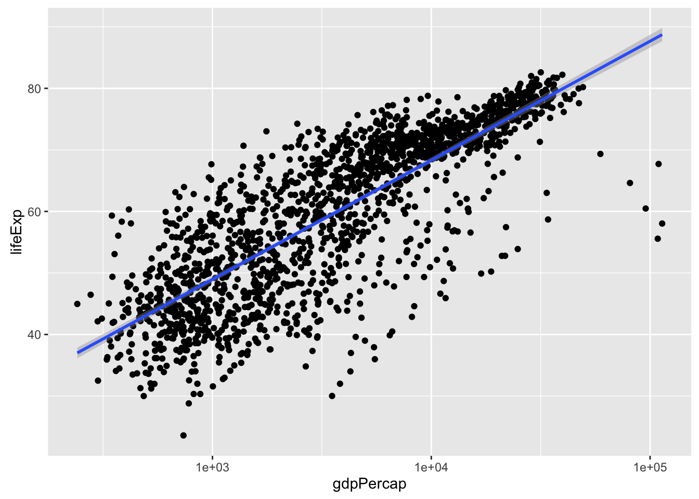

> #### Challenge -- The power of money, by continent {.challenge}
>
> - Modify the last plot to color points by continent and get a separate fit-line for each continent. 
>     - Tip: This can be done in one place, with fewer than 20 characters.
> - **Bonus**: Color the points by continent, but have only one line, fit to all of the data.

### Adjust appearances

Some people like the gray `ggplot` background, others call it "chart junk" -- distracting, uninformative ink. You can change the overall appearance of a plot by setting a new theme. E.g. `theme_bw` is a bit cleaner:

~~~{.r}
ggplot(gapminder, aes(x = gdpPercap, y = lifeExp)) +
    geom_point(aes(color = continent)) + 
    scale_x_log10() +
    geom_smooth(method = 'lm') +
    theme_bw()
~~~

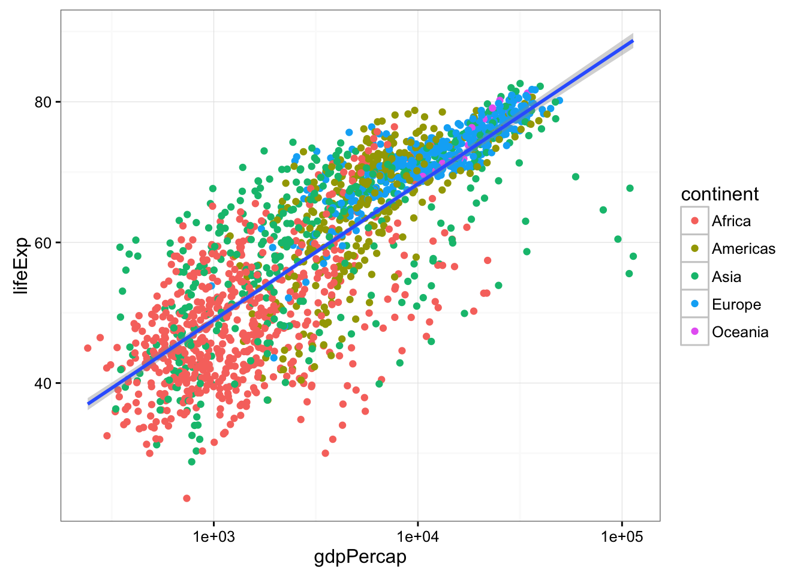

There are a variety of themes in a separate package called `ggthemes`, e.g. we can mimic The Economist [or many others](https://github.com/jrnold/ggthemes). Of course before we use the `ggthemes` package, we have to install it, which you can do with `install.packages('ggthemes')`.

~~~{.r}
library(ggthemes)
ggplot(gapminder, aes(x = gdpPercap, y = lifeExp)) +
    geom_point(aes(color = continent)) + 
    scale_x_log10() +
    geom_smooth(method = 'lm') +
    theme_economist()
~~~

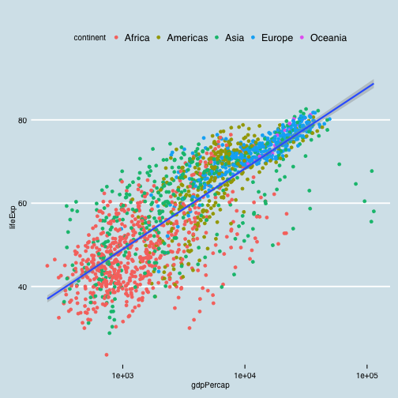

#### Changing fixed aspects of plots

Of course, rather than changing the theme of an entire plot, we often want to changes some specific aspect of it. Let's make our linear model line black instead of blue and dashed instead of solid, and let's make our points smaller. 

Note that when aesthetics are mapped from a variable, they go in `aes()`, but to set them to a fixed value, they go outside `aes()`.

~~~{.r}
ggplot(gapminder, aes(x = gdpPercap, y = lifeExp)) +
    geom_point(aes(color = continent), size = .25) + 
    scale_x_log10() +
    geom_smooth(method = 'lm', color = 'black', linetype = 'dashed') +
    theme_bw()
~~~

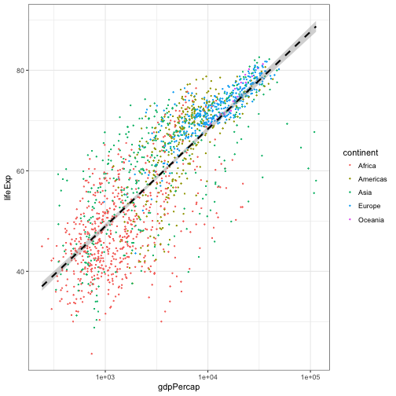

> #### Challenge -- sizing points {.challenge}
>
> Modify the previous plot to size the points in proportion to the population of the county.
>

### Multi-panel figures

Earlier we visualized the change in life expectancy over time across all
countries in one plot. 

~~~{.r}
ggplot(gapminder, aes(x = year, y = lifeExp, by = country)) +
    geom_line(aes(color = continent))
~~~

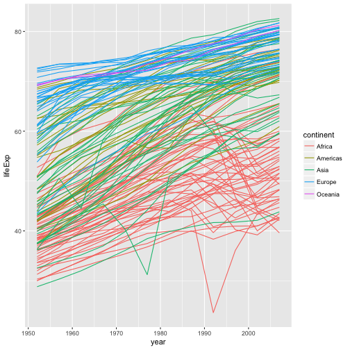

That's a mess! It's hard to see patterns because there is so much information on top of itself. We can split this out over multiple panels by adding another layer: **facet** panels. The `facet_wrap` layer takes a "formula" as its argument, denoted by the tilde (~). You can read this as "by continent". It tells R to draw a panel for each unique value of continent.

~~~{.r}
ggplot(gapminder, aes(x = year, y = lifeExp, by = country)) +
    geom_line(aes(color = continent)) +
    facet_wrap(~ continent)
~~~

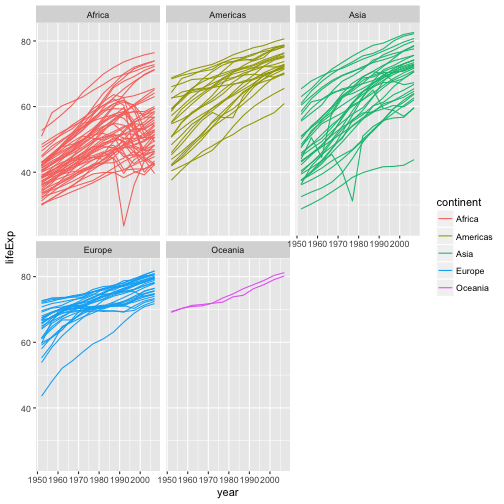

### Modifying text

To clean this figure up for a publication we need to change some of the text elements. The x-axis is way too cluttered, and the axis labels should read "Life expectancy" and "Year", rather than the column name in the data frame. Also, the country names don't fit in the strips at the top of each plot, and we might like to add an overall title to the figure.

We can do this by adding a few new layers. The `xlab` and `ylab` layers control the names of the x and y axes. The **theme** layer is where we change lots of minor details of a plot. here we'll rotate the axis text (with `angle`) so that they'll fit, and then make sure they're lined up right with `vjust` for vertical-adjustment. And let's add a plot title for fun; we can do that with `ggtitle` layer.

~~~{.r}
ggplot(gapminder, aes(x = year, y = lifeExp, by = country)) +
    geom_line(aes(color = continent)) +
    facet_wrap(~ continent) +
    xlab("Year") + 
    ylab("Life expectancy") + 
    theme_bw(base_size = 10) +
    scale_color_brewer(guide = "none", palette = "Dark2") +
    theme(axis.text.x = element_text(angle = 270, vjust = .5)) +
    ggtitle('Life expectancy over time by country')
~~~

### Saving plots

Now that we have that plot just the way we want it, let's write it to disk as an image. Of course, we could regenerate it by re-running our script, but we might want to make it available separately to show a collaborator or include in a document or presentation.

You can use the `ggsave` function to save a ggplot. By default, `ggave` will save the last generated plot in the same dimensions as your viewing pane. The only required argument to `ggsave` is the location of the file you want to write to. Using our project organization, let's write the last plot to `results/lifeExpByCountry.png`. `ggsave` will notices the extension of the filename and writes the file in that format. You can also save as .pdf, .jpg, and other file types.

~~~{.r}
ggsave('results/lifeExpByYear.png')
~~~

~~~{.output}
Saving 7 x 7 in image

~~~

Some of the country names are still getting squeezed, so let's make the canvas a little bigger, and we'll save a pdf file instead of a png. Let's also assign our plot to an object and explicitly save that plot to disk. You assign a ggplot object to a variable just like any other object.

~~~{.r}
myplot <- 
  ggplot(gapminder, aes(x = year, y = lifeExp, by = country)) +
    geom_line(aes(color = continent)) +
    facet_wrap(~ continent) +
    xlab("Year") + 
    ylab("Life expectancy") + 
    theme_bw(base_size = 14) +
    scale_color_brewer(guide = "none", palette = "Dark2") +
    theme(axis.text.x = element_text(angle = 270, vjust = .5)) +
    ggtitle('Life expectancy over time by country')
ggsave(filename = 'results/lifeExpByYear-bigger.pdf', 
       plot = myplot, 
       width = 12, height = 8)
~~~

### Wrap-up

This is just a taste of what you can do with `ggplot2`. RStudio provides a
really useful [cheat sheet][cheat] of the different layers available, and more
extensive documentation is available on the [ggplot2 website][ggplot-doc].
Finally, if you have no idea how to change something, a quick Google search will
usually send you to a relevant question and answer on Stack Overflow with reusable
code to modify!

[cheat]: http://www.rstudio.com/wp-content/uploads/2015/03/ggplot2-cheatsheet.pdf
[ggplot-doc]: http://docs.ggplot2.org/current/

> #### Challenge 5 {.challenge}
>
> Create a density plot of GDP per capita, with a separate curve for each continent, with color filled by continent. Save the plot to your `results/` directory.
>
> **Advanced**:
> 
>   - Adjust the opacity (`alpha`) of the density curves so all are visible.
>   - Transform the-x axis to better visualize the data spread.
>   - Add a facet layer to panel the density plots by year.
>

## Challenge solutions

> #### Solution to challenge 1 {.challenge}
>
> Modify the example so that the figure visualize how life expectancy has
> changed over time:
>
> 
> ~~~{.r}
> ggplot(gapminder, aes(x = year, y = lifeExp)) + geom_point()
> ~~~
> 
> 
>

> #### Solution to challenge 2 {.challenge}
>
> In the previous examples and challenge we've used the `aes` function to tell
> the scatterplot **geom** about the **x** and **y** locations of each point.
> Another *aesthetic* property we can modify is the point *color*. Modify the
> code from the previous challenge to **color** the points by the "continent"
> column. What trends do you see in the data? Are they what you expected?
>
> 
> ~~~{.r}
> ggplot(gapminder, aes(x = year, y = lifeExp, color=continent)) +
>   geom_point()
> ~~~
> 
> 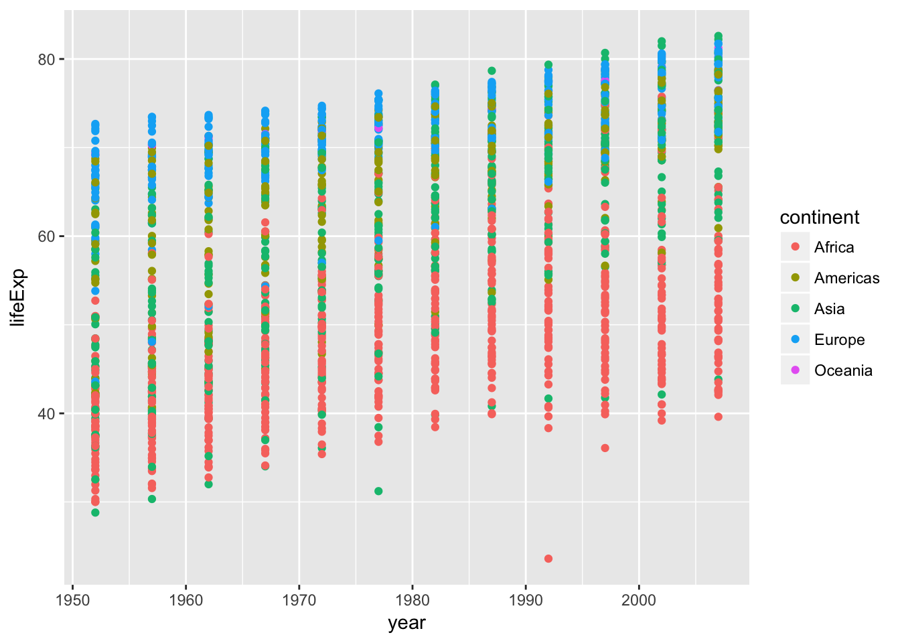
>

> #### Solution to challenge 3 {.challenge}
>
> Switch the order of the point and line layers from the previous example. What
> happened?
>
> 
> ~~~{.r}
> ggplot(gapminder, aes(x=year, y=lifeExp, by=country)) +
>  geom_point() + geom_line(aes(color=continent))
> ~~~
> 
> 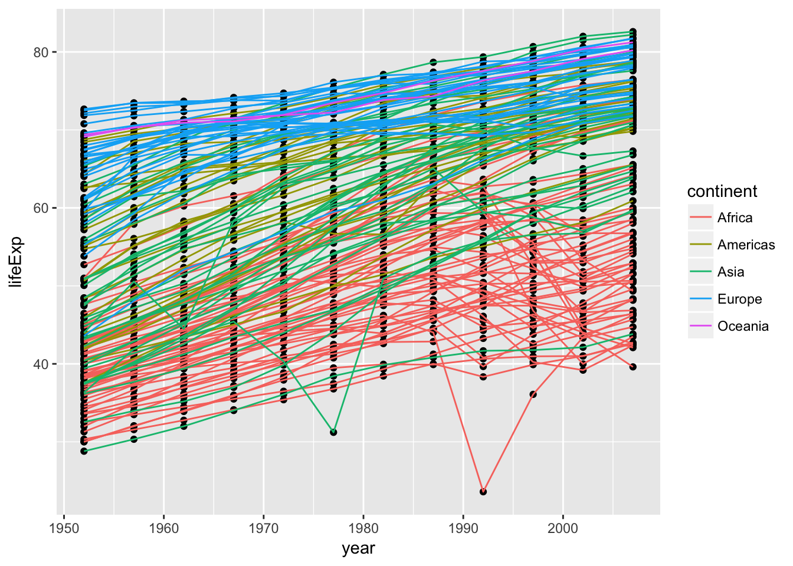
> 
> The lines now get drawn over the points!
>

> #### Solution to challenge 4 {.challenge}
>
> Modify the color and size of the points on the point layer in the previous
> example.
>
> Hint: do not use the `aes` function.
>
> 
> ~~~{.r}
> ggplot(gapminder, aes(x = lifeExp, y = gdpPercap)) +
>  geom_point(size=3, color="orange") + scale_y_log10() +
>  geom_smooth(method="lm", size=1.5)
> ~~~
> 
> 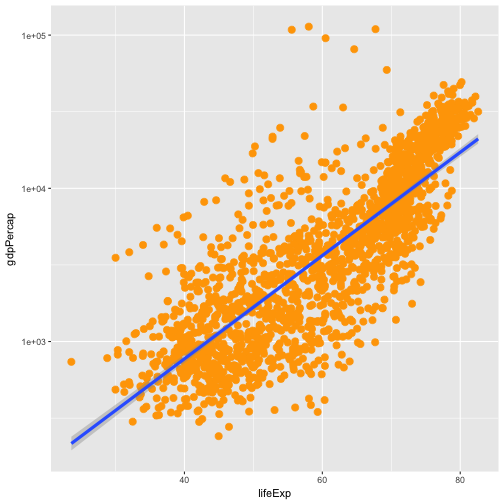
>

> #### Solution to challenge 5 {.challenge}
>
> Create a density plot of GDP per capita, filled by continent.
>
> Advanced:
>  - Transform the x axis to better visualize the data spread.
>  - Add a facet layer to panel the density plots by year.
>
> 
> ~~~{.r}
> ggplot(gapminder, aes(x = gdpPercap, fill=continent)) +
>  geom_density(alpha=0.6) + facet_wrap( ~ year) + scale_x_log10()
> ~~~
> 
> 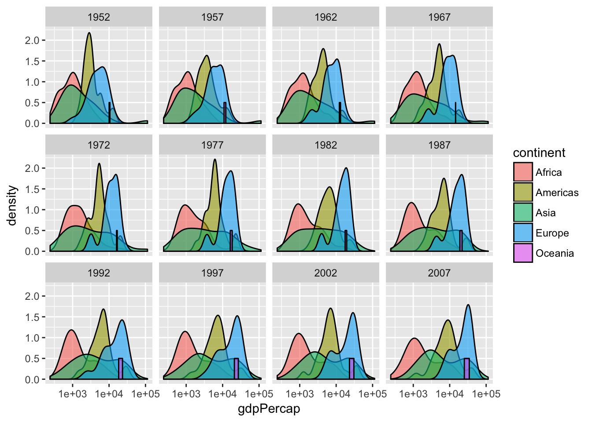
>
