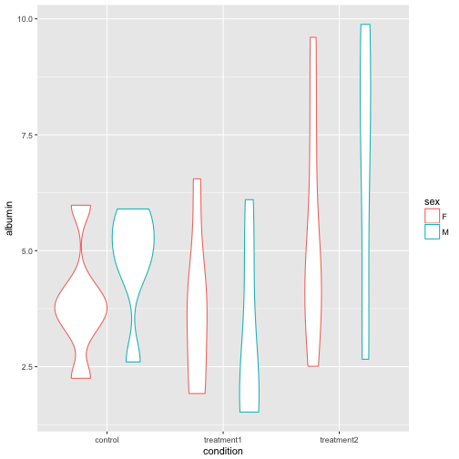

> ## Learning objectives {.objectives}
>
> - Understand what it means for data to be tidy
>     - Each variable forms a column.
>     - Each observation forms a row.
>     - Each type of observational unit forms a table.
> - Be able to use `tidyr::gather` to make "wide" data "long"
>

### Tidy data

Data can be organized many ways. While there may be times that call for other organizational schemes, this is the standard and generally-best way to organize data:

1. Each variable forms a column
1. Each observation forms a row
1. Each observational type forms a table

What exactly constitutes a variable can be difficult to define out of context, but as a general rule, if observations are measured in different units, they should be in different columns, and if they are measured in the same units, there is a good chance they should be in the same column.

An example will clarify. Download [this fake data](https://raw.githubusercontent.com/michaellevy/gapminder-R/gh-pages/data/wide_eg.csv) on blood readings under several medical treatments. Save it to your data directory and read it into R. Is this data in tidy format? Why not -- which of the three principles does it not satisfy?


~~~{.r}
blood <- read_csv('data/wide_eg.csv')
blood
~~~


~~~{.output}
# A tibble: 14 × 5
   `Blood albumin levels in four individuals (g / dL)`    X2      X3
                                                 <chr> <chr>   <chr>
1                                                 <NA>  <NA>    <NA>
2                                              subject   sex control
3                                                    1     M    4.49
4                                                    2     F    5.98
5                                                    3     F    3.77
6                                                    4     M    2.60
7                                                    5     m    5.20
8                                                    6     F    4.22
9                                                    7     F    2.25
10                                                   8     F    3.76
11                                                   9     M    4.93
12                                                  10     M    5.66
13                                                  11     F    3.30
14                                                  12     M    5.90
# ... with 2 more variables: X4 <chr>, X5 <chr>

~~~

Hmm, that doesn't look quite right? What do you think happened? How could we fix it? The answer, of course, is in the `?read_csv` helpfile.


~~~{.r}
blood <- read_csv('data/wide_eg.csv', skip = 2)
blood
~~~


~~~{.output}
# A tibble: 12 × 5
   subject   sex control treatment1 treatment2
     <int> <chr>   <dbl>      <dbl>      <dbl>
1        1     M    4.49       1.61       3.03
2        2     F    5.98       3.40       3.79
3        3     F    3.77       1.92       4.66
4        4     M    2.60       4.72       7.48
5        5     m    5.20       1.76       9.77
6        6     F    4.22       4.41       7.23
7        7     F    2.25       6.55       2.51
8        8     F    3.76       1.92       9.60
9        9     M    4.93       2.73       7.26
10      10     M    5.66       6.10       9.88
11      11     F    3.30       3.92       4.47
12      12     M    5.90       1.52       2.66

~~~

There's one other little problem in this dataset -- do you see it? One of the subject's sexes was entered as "m" instead of "M". If we later try to `group_by` sex or plot by sex, we will get three groups: "F", "M", and "m". To fix this, we could identify the errant entry and replace it specifically with something like `blood$sex[blood$sex == "m"] = "M"`, or we can simply tell R to make all the entries in that variable upper-case with the `toupper` function:


~~~{.r}
blood$sex
~~~


~~~{.output}
 [1] "M" "F" "F" "M" "m" "F" "F" "F" "M" "M" "F" "M"

~~~


~~~{.r}
toupper(blood$sex)
~~~


~~~{.output}
 [1] "M" "F" "F" "M" "M" "F" "F" "F" "M" "M" "F" "M"

~~~


~~~{.r}
blood$sex = toupper(blood$sex)
# Or, using dplyr:
blood = mutate(blood, sex = toupper(sex))
# Note that those accomplish the exact same thing in very different ways. Studying the difference may be useful. 
blood
~~~


~~~{.output}
# A tibble: 12 × 5
   subject   sex control treatment1 treatment2
     <int> <chr>   <dbl>      <dbl>      <dbl>
1        1     M    4.49       1.61       3.03
2        2     F    5.98       3.40       3.79
3        3     F    3.77       1.92       4.66
4        4     M    2.60       4.72       7.48
5        5     M    5.20       1.76       9.77
6        6     F    4.22       4.41       7.23
7        7     F    2.25       6.55       2.51
8        8     F    3.76       1.92       9.60
9        9     M    4.93       2.73       7.26
10      10     M    5.66       6.10       9.88
11      11     F    3.30       3.92       4.47
12      12     M    5.90       1.52       2.66

~~~

It looks like we've got 12 individuals, each subjected to three conditions -- a control and two treatments. Each observation here is a person in a treatment (we don't know what the measured value is), so each row should be defined by a person-treatment; that is, we should have 12 rows with four columns: subject, sex, condition, and the measured value. 

#### `gather()` 

A typical analysis of data like these consists of calculating means and standard deviations by condition and sex. It is possible to do this with the data in their current form, but it will be much easier if we tidy the data first.

We can transform the data to tidy form with the `gather` function from the `tidyr` package, which of course is part of the `tidyverse`.

Let's look at the arguments to `gather` include the data.frame you're gathering, which columns to gather, and names for two columns in the new data.frame: the key and the value. The key will consist of the old names of gathered columns, and the value will consist of the entries in those columns. The order of arguments is data.frame, key, value, columns-to-gather:


~~~{.r}
gather(blood, key = condition, value = albumin,
       control, treatment1, treatment2)
~~~


~~~{.output}
# A tibble: 36 × 4
   subject   sex condition albumin
     <int> <chr>     <chr>   <dbl>
1        1     M   control    4.49
2        2     F   control    5.98
3        3     F   control    3.77
4        4     M   control    2.60
5        5     M   control    5.20
6        6     F   control    4.22
7        7     F   control    2.25
8        8     F   control    3.76
9        9     M   control    4.93
10      10     M   control    5.66
# ... with 26 more rows

~~~

You can also tell `gather` which columns *not* to gather -- these are the "ID variables"; that is, they identify the unit of analysis on each row.


~~~{.r}
blood.tidy <- gather(blood, key = condition, value = albumin,
                     -subject, -sex)
~~~

Note that the variables with `-` in front of them aren't removed from the data.frame. Instead we get one row for each combination of those variables.

### Packages in the tidyverse expect tidy data

Now that the `blood` data is in tidy form we can easily summarize and plot it using *dplyr* and *ggplot2*.


~~~{.r}
summarize(group_by(blood.tidy, sex, condition),
          mean(albumin),
          sd(albumin))
~~~


~~~{.output}
Source: local data frame [6 x 4]
Groups: sex [?]

    sex  condition `mean(albumin)` `sd(albumin)`
  <chr>      <chr>           <dbl>         <dbl>
1     F    control        3.880000      1.228446
2     F treatment1        3.686667      1.737857
3     F treatment2        5.376667      2.582337
4     M    control        4.796667      1.188489
5     M treatment1        3.073333      1.911499
6     M treatment2        6.680000      3.170091

~~~


~~~{.r}
ggplot(blood.tidy, aes(x = condition, y = albumin, color = sex)) +
          geom_violin()
~~~



> #### Challenge -- Gather and plot {.challenge}
>
> The following code produces a data.frame with the annual relative standard deviation of gdp among countries, both by per-capita gdp and country-total gdp. Run the code. Is the resulting dataset in tidy form? 
> 
> ```
> gapminder %>%
>     mutate(gdpCountry = gdpPercap * pop) %>%
>     group_by(year) %>%
>     summarize(RSD_individual = sd(gdpPercap) / mean(gdpPercap),
>               RSD_country = sd(gdpCountry) / mean(gdpCountry))
> ```
>
> You could argue that it is or is not in tidy form, because you could see the two outcomes as different variables or two ways of measuring the same variable. For our purposes, consider them two ways of measuring the same variable and `gather` the data.frame so that there is only one measurement of RSD on each row.
> 
> Make a plot with two lines, one for each measure of RSD in gdp, by year. To make the plot black-and-white-printer friendly, distinguish the lines using the `linetype` **aes**thetic. Could you have made this plot without tidying the data? Why or why not?
>


> #### Challenge -- More practice with gather {.challenge}
>
> Download [this dataset](https://raw.githubusercontent.com/michaellevy/gapminder-R/gh-pages/data/stocks.tsv) of closing prices for several restaurant stocks over a year.
>
> - Is the data tidy?  
> - If not, tidy it
> - Which stock performed the best over this year? Use any method you want to answer that question.
>
