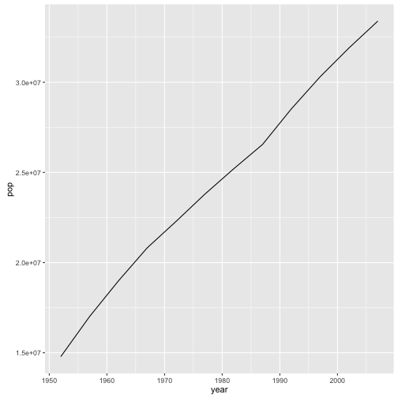

> ## Learning objectives {.objectives}
>
> * Define a function that takes arguments.
> * Return a value from a function.
> * Test a function.
> * Set default values for function arguments.
> * Explain why we should divide programs into small, single-purpose functions.
>

Any operation you will perform more than once can be put into a function. That way, rather than retyping all the commands (and potentially making errors), you can simply call the function, passing it a new dataset or parameters. This may seem combersome at first, but writing functions to automate repatitive tasks is incredibly powerful. E.g. each time you call `ggplot` you are calling a function that someone wrote. Imagine if each time you wanted to make a plot you had to copy and paste or write that code from scratch!

### Defining a function

Recall the components of a function. E.g. the `log` function (see `?log`) takes "arguments" `x` and `base` and "returns" the base-`base` logarithm of `x`. Functions take arguments as input and yield return-values as output. You can define functions to do any number of operations on any number of arguments, but always output a single return value (however there are complex objects into which you can put multiple objects, should you need to).

Let's start by defining a simple function to add two numbers. This is the basic structure, which you can read as "assign to the variable `my_sum` a function that takes arguments `a` and `b` and returns `the_sum`." The body of the function is delimited by the curly-braces. The statements in the body are indented. This makes the code easier to read but does not affect how the code operates. 

~~~{.r}
my_sum <- function(a, b) {
  the_sum <- a + b
  return(the_sum)
}
~~~

Notice that no numbers were summed when we ran that code, but now the Environment has an object called `my_sum` that has type function. You can call `my_sum` just like you would any other function. When you do, the code between the curly-braces of the `my_sum` definition is run with whatever values you pass to `a` and `b` substituted in their place.

~~~{.r}
my_sum(a = 2, b = 2)
~~~

~~~{.output}
[1] 4

~~~

~~~{.r}
my_sum(3, 4)
~~~

~~~{.output}
[1] 7

~~~

Just like `log` provides a default value of `base` (`exp(1)`) so that you don't have to type it every time, you can provide default values to any arguments of your function. Then if the user doesn't specify them, the defaults will be used.

~~~{.r}
my_sum2 <- function(a = 1, b = 2) {
  the_sum <- a + b
  return(the_sum)
}
my_sum2()
~~~

~~~{.output}
[1] 3

~~~

~~~{.r}
my_sum2(b = 7)
~~~

~~~{.output}
[1] 8

~~~

> ## Tip {.callout}
>
> One feature unique to R is that the return statement is not required.
> R automatically returns the output of the last line of the body
> of the function unless a `return` statement is specified elsewhere.
> Since other languages require a `return` statement and because it can make
> reading a funciton easier, we will explicitly define the return statement.

#### Temperature conversion

Let’s define a function F_to_K that converts temperatures from Fahrenheit to Kelvin:

~~~{.r}
F_to_K <- function(temp) {
  K <- ((temp - 32) * (5 / 9)) + 273.15
  return(K)
}
~~~

Calling our own function is no different from calling any other function:

~~~{.r}
# freezing point of water
F_to_K(32)
~~~

~~~{.output}
[1] 273.15

~~~

~~~{.r}
# boiling point of water
F_to_K(212)
~~~

~~~{.output}
[1] 373.15

~~~

> #### Challenge 1 {.challenge}
>
> - Write a function called `K_to_C` that takes a temperature in K
> and returns that temperature in C
>    - Hint: To convert from K to C you subtract 273.15
> - Create a new R script, copy `F_to_K` and `K_to_C` in it, and save it as 
> functions.R in the `code` directory of your project.

#### `source()`ing functions

You can load all the functions in your `code/functions.R` script without even opening the file, via the `source` function. This allows you to keep your functions separate from the analyses which use them. 

~~~{.r}
source('code/functions.R')
~~~

#### Combining functions

The real power of functions comes from mixing, matching and combining them
into ever large chunks to get the effect we want.

> #### Challenge 2 {.challenge}
>
> - Write a new function called `F_to_C` in your functions.R file that converts 
> temperature directly from F to C by reusing the two functions above.
> - Load the function not by highlighting the code but by `source`-ing your functions.R file.
> - Use the function to find today's high temperature in your location in C.
>

### A more-useful function

Let's write a function to find the GPD of a country for a given year. Our data will be the same gapminder data.frame we have been working with, but we want to keep our function flexible, so that if we get a new data.frame with the same information, say updated with 2012 data, we can pass it to the same function. So, we will pass the gapminder data.frame to the function as an arguement rather than "hard-coding" the `gapminder` data.frame, and we will set `gapminder` as the default value for ease of use. The other arguments our function needs are the country and year for which to calculate GDP. For clarity, we will call these `the_country` and `the_year`. Here is the function definition, without any body. Currently it won't do anything.

~~~{.r}
calcGDP <- function(the_country, the_year, dat = gapminder) {
  
}
~~~

When we call the function we will use a syntax like 
`calcGDP(the_country = 'China', the_year = 2007)`. Then, inside the body of calcGDP, everywhere `the_country` appears, 'China' will be substituted, and everywhere `the_year` appears, 2007 will be substituted. With that in mind, we filter to the country and year we want just like we would using "China" and 2007 directly, and assign the new data.frame to `filteredDF`. Note that `filteredDF` only exists inside the funciton. It will be created when we call `calcGDP`, but it won't appear in our Environment, and it will be gone as soon as `calcGDP` returns its return value.

~~~{.r}
calcGDP <- function(the_country, the_year, dat = gapminder) {
    filteredDF <- filter(dat, country == the_country, year == the_year)
}
~~~

Now we have a data.frame filtered to the country and year we want, but we still need to calculate total GDP. We can use `mutate` from `dplyr` to calculate a new column, and then tell calcGDP to `return` the data.frame with the new column:

~~~{.r}
calcGDP <- function(the_country, the_year, dat = gapminder) {
    filteredDF <- filter(dat, country == the_country & year == the_year)
    filteredWithGDP <- mutate(filteredDF, GDP = gdpPercap * pop)
    return(filteredWithGDP)
}
calcGDP('China', 2007)
~~~

~~~{.output}
  country year        pop continent lifeExp gdpPercap          GDP
1   China 2007 1318683096      Asia  72.961  4959.115 6.539501e+12

~~~

#### Making the function flexible

Okay, but what if we want that information for multiple years or multiple countries. The `%in%` function is similar to `==`, but it allows multiple entries on the right hand side. For example:

~~~{.r}
3 %in% 1:10
~~~

~~~{.output}
[1] TRUE

~~~

~~~{.r}
'sam' %in% c('jim', 'joe', 'bob')
~~~

~~~{.output}
[1] FALSE

~~~

We can replace the `==` tests in our function with `%in%` to allow it to take multiple years and continents. We will also change the names of `calcGDP`'s arguements to make it more intuitive that they can take multiple values. We should also add some comments to our code to make it easy to understand what it does.

~~~{.r}
calcGDP <- function(countries, years, dat = gapminder) {
    
    # Given a gapminder-like data.frame and sets of countries and years, returns the corresponding rows of the data.frame with a new column for the countries' total GDP.
    # Arguments:
    #   countries: character vector
    #   years: numeric vector
    # Returns: data.frame with new GDP variable
    
    filteredDF <- filter(dat, country %in% countries, year %in% years)
    filteredWithGDP <- mutate(filteredDF, GDP = gdpPercap * pop)
    return(filteredWithGDP)
}
calcGDP(countries = c('China', 'Japan', 'Korea Rep.'), years = 1970:1990)
~~~

~~~{.output}
      country year        pop continent  lifeExp  gdpPercap          GDP
1       China 1972  862030000      Asia 63.11888   676.9001 5.835082e+11
2       China 1977  943455000      Asia 63.96736   741.2375 6.993242e+11
3       China 1982 1000281000      Asia 65.52500   962.4214 9.626918e+11
4       China 1987 1084035000      Asia 67.27400  1378.9040 1.494780e+12
5       Japan 1972  107188273      Asia 73.42000 14778.7864 1.584113e+12
6       Japan 1977  113872473      Asia 75.38000 16610.3770 1.891465e+12
7       Japan 1982  118454974      Asia 77.11000 19384.1057 2.296144e+12
8       Japan 1987  122091325      Asia 78.67000 22375.9419 2.731908e+12
9  Korea Rep. 1972   33505000      Asia 62.61200  3030.8767 1.015495e+11
10 Korea Rep. 1977   36436000      Asia 64.76600  4657.2210 1.696905e+11
11 Korea Rep. 1982   39326000      Asia 67.12300  5622.9425 2.211278e+11
12 Korea Rep. 1987   41622000      Asia 69.81000  8533.0888 3.551642e+11

~~~

> #### Tip: Pass by value {.callout}
>
> Functions in R almost always make copies of the data to operate on
> inside of a function body. When we modify `dat` inside the function
> we are modifying the copy of the gapminder dataset stored in `dat`,
> not the original variable we gave as the first argument.
>
> This is called "pass-by-value" and it makes writing code much safer:
> you can always be sure that whatever changes you make within the
> body of the function, stay inside the body of the function.
>

> #### Tip: Function scope {.callout}
>
> A related concept is scoping: any variables you
> create or modify inside the body of a function only exist for the lifetime
> of the function's execution. When we call `calcGDP`, the variables `dat`,
>  `years`, and `filteredDF` only exist inside the body of the function. Even if we
> have variables of the same name in our interactive R session, they are
> not modified in any way when executing a function.
>

> #### Challenge -- A new function {.challenge}
> 
>
> Write a new function that takes two arguments, the gapminder data.frame and the name of a country, and plots the change in the country's population over time. That is, the return value from the function should be a ggplot object.
>   - It is often easier to modify existing code than to start from scratch. Feel free to start with the calcGDP function code.

### Challenge solutions

> #### Solution -- A new function {.challenge}
>
> 
> ~~~{.r}
> plotPopGrowth <- function(countrytoplot, dat = gapminder) {
>     df <- filter(dat, country == countrytoplot) 
>     plot <- ggplot(df, aes(year, pop)) + 
>         geom_line()
>     return(plot)
> }
> plotPopGrowth('Canada')
> ~~~
> 
> 
> 

