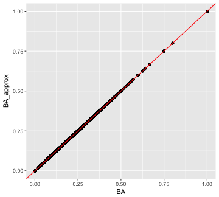
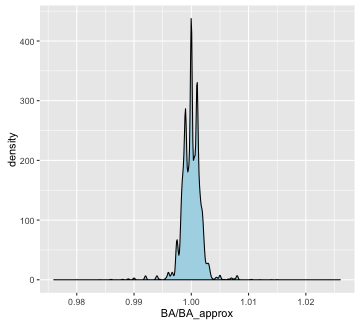
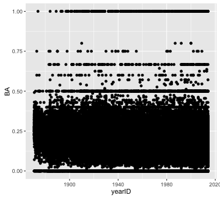
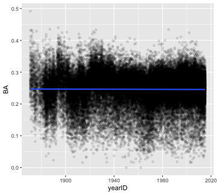
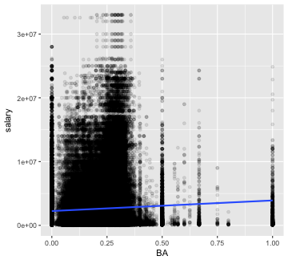
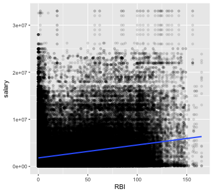
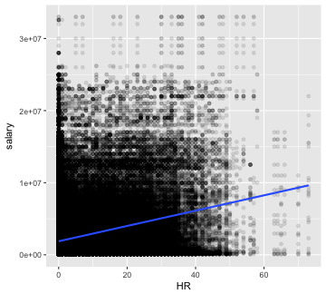
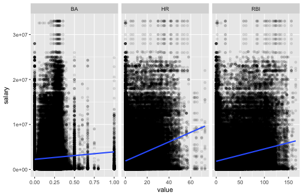

This webpage is the product of an RMarkdown document. Most of the R code used to produce it is viewable here, but if you would like to see the raw .Rmd file to see the use of inline code, RMarkdown options, etc., you can view or download the source [here](https://raw.githubusercontent.com/data-lessons/gapminder-R/gh-pages/11-capstone_solutions.Rmd). 

# Setup

Set some global document properties and load the data and some useful packages.


```r
library(tidyverse)
library(Lahman)
data('Batting')
data('Salaries')
```

#### Getting acquanited

> Explore the two data.frames. Write a short summary. What time periods do they cover? How many players are in the dataset? What is the maximum recorded salary?

We can calculate all of these statistics directly in the text of our writeup...

The batting data range from 1871 - 2015, while the salary data start at 1985. 

<!-- There are 223251 missing data points in the Batting dataset, which represents 10% of the cells in the table. -->

There are 18659 players in the batting dataset, and 4963 in the salary dataset.

The maximum salary earned is $33000000, which was earned by rodrial01 in 2009.


#### Batting averages

To approximate a player's batting average we divide their number of at bats by the number of hits they got. Then let's glance at the top of our data.frame to make sure the numbers look reasonable.


```r
Batting <- mutate(Batting, BA_approx = H / AB)
head(select(Batting, H, AB, BA_approx))
```

```
##    H  AB BA_approx
## 1  0   4 0.0000000
## 2 32 118 0.2711864
## 3 40 137 0.2919708
## 4 44 133 0.3308271
## 5 39 120 0.3250000
## 6 11  49 0.2244898
```

Using the `battingStats` function that comes with the `Lahman` package, we can calculate players' actual batting averages (accounting for things like at-bats where the batter got on base without getting a hit, for example).


```r
Batting <- battingStats(Batting)
```

Let's take a look at how our approximation of batting average compares with the actual statistic. We'll draw a 1:1 line for comparison.


```r
ggplot(Batting, aes(x = BA, y = BA_approx)) + 
    geom_point() + 
    geom_abline(slope = 1, intercept = 0, color = 'red')
```



Wow, it is very close! Are they exactly the same? There are a few ways we could look at that. Let's plot the distribution of ratios of the statistics. Where that ratio is one, they are the same.


```r
ggplot(Batting, aes(x = BA / BA_approx)) + 
    geom_density(fill = 'lightblue') 
```




#### Batting averages over time


```r
ggplot(Batting, aes(x = yearID, y = BA)) +
    geom_point() 
```



What a mess! There is so much over-plotting we can't see where there is more data versus less. Also, the fact that there are so many 0, 0.5, and 1.0 entries suggests there are many data points with a small number of at bats. Let's filter to only those players who had at least 50 at bats, add some transparency to the points, and fit a linear trend line.

It looks like batting averages have stayed pretty steady over time.


```r
filter(Batting, AB > 50) %>%
    ggplot(aes(x = yearID, y = BA)) +
    geom_point(alpha = .1) +
    geom_smooth(method = 'lm')
```




#### Home run kings

Here are the top-five career home run hitters. Calculating number of seasons with `n()` will get close, but if a player played for multiple teams within a year, they will have multiple entries for that year.


```r
group_by(Batting, playerID) %>%
    summarize(careerHR = sum(HR),
              seasons = length(unique(yearID))) %>%
    arrange(desc(careerHR)) %>%
    head(n = 5)
```

```
## # A tibble: 5 × 3
##    playerID careerHR seasons
##       <chr>    <int>   <int>
## 1 bondsba01      762      22
## 2 aaronha01      755      23
## 3  ruthba01      714      22
## 4  mayswi01      660      22
## 5 rodrial01      654      20
```


> What is the most home runs in a single season?

If you are willing to ignore the fact that some players play for more than one team in a year (and so have multiple entries in one season), you can just sort the data.frame by HR (descending).


```r
arrange(Batting, desc(HR)) %>%
    select(playerID, yearID, HR) %>%
    head(n = 10)
```

```
##     playerID yearID HR
## 1  bondsba01   2001 73
## 2  mcgwima01   1998 70
## 3   sosasa01   1998 66
## 4  mcgwima01   1999 65
## 5   sosasa01   2001 64
## 6   sosasa01   1999 63
## 7  marisro01   1961 61
## 8   ruthba01   1927 60
## 9   ruthba01   1921 59
## 10  foxxji01   1932 58
```

To avoid having to make that assumption, we need to group multiple rows for the same player in the same year, and add the number of home runs. In order to get `arrange` working properly, we need to remove the grouping; otherwise, it will try to arrange within the groups. Here though, the assumption doesn't do any harm.


```r
group_by(Batting, playerID, yearID) %>%
    summarize(yearHR = sum(HR)) %>%
    ungroup() %>%
    arrange(desc(yearHR)) %>%
    head(n = 10)
```

```
## # A tibble: 10 × 3
##     playerID yearID yearHR
##        <chr>  <int>  <int>
## 1  bondsba01   2001     73
## 2  mcgwima01   1998     70
## 3   sosasa01   1998     66
## 4  mcgwima01   1999     65
## 5   sosasa01   2001     64
## 6   sosasa01   1999     63
## 7  marisro01   1961     61
## 8   ruthba01   1927     60
## 9   ruthba01   1921     59
## 10  foxxji01   1932     58
```


 
#### Batting & Salaries

> We want to examine how batting ability relates to salaries earned. For only the entries where salary data is available, join the two data.frames.

To keep only the entries that have a salary, either use `left_join` and make Salaries the first table, or use `right_join` and make Batting the first table.


```r
battingSalaries <- right_join(Batting, Salaries, "playerID", "yearID")
```

> The three components of the batting triple crown are batting average, runs batted in (RBI), and home runs. Plot salary against each of the three statistics. Which appears to have the strongest relationship with a player's salary?

There are two ways to do this; either make a separate plot for each of the three statistics (we'll write a function to do that to avoid typing the whole thing three times), or tidy the data across statistics, making one column for the name of the statistic and another for its value, and then faceting the plot by statistic. Here's how to do each:

##### Separate plots

Let's write a function that takes the `battingSalaries` data.frame and a batting statistic and plots the statistic against salary earned, with some transparency to help with over-plotting, and add a linear trend line.

- There is one tricky new thing here. When you use `ggplot` inside a function and you want to use a variable name (e.g. RBI) as an argument to the function, you have to use `aes_string` instead of `aes` inside `ggplot`, and you put any column names that you're using directly in quotes. That is, if the variable you want to map to x, or y, or color, or whatever is itself a variable that contains the name of a column in the data.frame, rather than the name of a column in the data.frame, you use `aes_string`. Inside `aes_string` don't use quotes for variables that contain column names, but do use quotes for column names. The mechanism is beyond the scope of this workshop, but it has to do with "non-standard evaluation." If you want to know more, Google that phrase along with ggplot. The same thing applies to using `dplyr` within functions: You can use `filter_`, `arrange_`, etc.

All three statistics appear to be associated with higher salaries.


```r
plotVsSalary <- function(statistic, df = battingSalaries) {
    ggplot(df, aes_string(x = statistic, y = 'salary')) +
    geom_point(alpha = .1) +
    geom_smooth(method = 'lm')
}
plotVsSalary(statistic = 'BA')
```



```r
plotVsSalary(statistic = 'RBI')
```



```r
plotVsSalary(statistic = 'HR')
```



##### Faceted plots

Alternatively, you could use `tidyr`'s `gather` to put all the batting statistics in one column, and then facet by the batting statistic. In this case, use the `scales` argument to `facet_wrap` to get avoid plotting batting averages (0 - 1) on the same scale as home runs (0 - 73), etc.


```r
library(tidyr)
gather(battingSalaries, stat, value, BA, RBI, HR) %>%
    ggplot(aes(x = value, y = salary)) + 
    geom_point(alpha = .1) +
    geom_smooth(method = 'lm') +
    facet_wrap(~ stat, scales = 'free_x')
```




> Run a multiple linear regression of salary on the three batting statistics. Are the results of the model consistent with the conclusions from your plots?

No! After accounting for home runs, it looks like batting average and RBI are *negatively* associated with salary! Of course, there are many factors to consider before concluding that players should start getting fewer hits if they want to make more money (e.g. filtering players with very few at-bats or weighting data-points by the number of at bats, accounting for clustering at the team level, filtering pitchers who are paid for skills other than batting, etc.)


```r
lm(salary ~ HR + BA + RBI, data = battingSalaries) %>%
    summary()
```

```
## 
## Call:
## lm(formula = salary ~ HR + BA + RBI, data = battingSalaries)
## 
## Residuals:
##       Min        1Q    Median        3Q       Max 
## -10039137  -1864384  -1344822    653037  31130406 
## 
## Coefficients:
##               Estimate Std. Error t value Pr(>|t|)    
## (Intercept)  2146809.8    15994.8 134.219  < 2e-16 ***
## HR            120590.2     2041.3  59.076  < 2e-16 ***
## BA          -1329219.2    71245.6 -18.657  < 2e-16 ***
## RBI            -3027.5      619.2  -4.889 1.01e-06 ***
## ---
## Signif. codes:  0 '***' 0.001 '**' 0.01 '*' 0.05 '.' 0.1 ' ' 1
## 
## Residual standard error: 3684000 on 231466 degrees of freedom
##   (62525 observations deleted due to missingness)
## Multiple R-squared:  0.07447,	Adjusted R-squared:  0.07446 
## F-statistic:  6208 on 3 and 231466 DF,  p-value: < 2.2e-16
```


#### Advanced: triple crown winners

> To win the triple crown is to have the most home runs and RBI and the highest batting average in a league for a year. Since 1957, only batters with at least 502 at-bats are eligible for the highest batting average. There have been three triple crown winners since 1957 -- can you identify them?

This might be a good candidate for the type of problem where it's useful to map
what you want to do before you start writing code. Here is one way to attack this
problem:

1. Filter to the eligible players and years of interest (`filter`)
1. Group by year and league and identify the maximal values for each of the three statistics in each of the groups (`group_by %>% summarize`)
1. Add columns for the maximal values to the original data.frame (`X_join`)
1. Filter to rows where the player's value equals the maximal value for each of the three statistics (`filter`)


```r
best = 
    filter(Batting, AB >= 502, yearID >= 1957) %>%
    group_by(yearID, lgID) %>%
    summarize(topBA = max(BA),
              topRBI = max(RBI),
              topHR = max(HR))
withBest = right_join(Batting, best, by = c("yearID", "lgID"))
filter(withBest, BA == topBA & RBI == topRBI & HR == topHR)
```

```
##    playerID yearID stint teamID lgID   G  AB   R   H X2B X3B HR RBI SB CS
## 1 robinfr02   1966     1    BAL   AL 155 576 122 182  34   2 49 122  8  5
## 2 yastrca01   1967     1    BOS   AL 161 579 112 189  31   4 44 121 10  8
## 3 cabremi01   2012     1    DET   AL 161 622 109 205  40   0 44 139  4  1
##   BB SO IBB HBP SH SF GIDP BA_approx    BA  PA  TB SlugPct   OBP   OPS
## 1 87 90  11  10  0  7   24 0.3159722 0.316 680 367   0.637 0.410 1.047
## 2 91 69  11   4  1  5    5 0.3264249 0.326 680 360   0.622 0.418 1.040
## 3 66 98  17   3  0  6   28 0.3295820 0.330 697 377   0.606 0.393 0.999
##   BABIP topBA topRBI topHR
## 1 0.300 0.316    122    49
## 2 0.308 0.326    121    44
## 3 0.331 0.330    139    44
```
